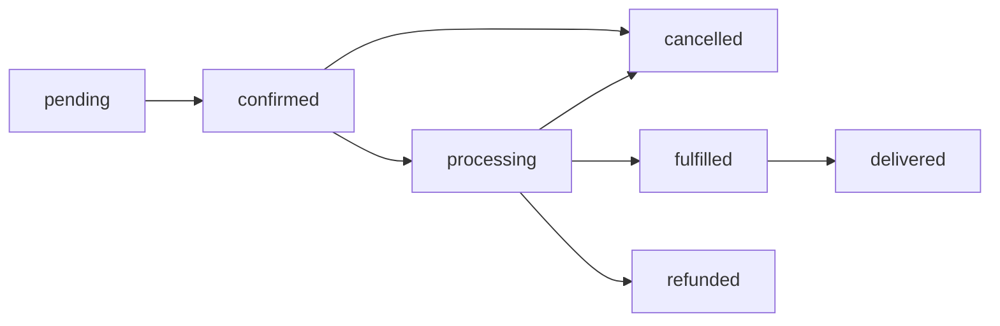

[Documentation Index](../index.md) / module3-services / Order Service

# Order Service

**File:** `src/services/OrderService.ts`

The Order Service owns the complete order lifecycle — creation, state machine transitions, and fulfilment partner routing.

---

## Table of Contents

- [Responsibilities](#responsibilities)
- [State Machine](#state-machine)
- [Methods](#methods)
- [Fulfilment Routing](#fulfilment-routing)
- [Error Reference](#error-reference)

---

## Responsibilities

- Validate and persist new orders
- Enforce the order state machine — reject illegal transitions
- Route orders to the correct fulfilment partner on status change to `processing`
- Emit notification events at key lifecycle points
- Never own payment logic — delegates to `PaymentService`

---

## State Machine

Any transition not shown in this diagram throws `AppError('INVALID_STATE_TRANSITION', 400)`.

---

## Methods

### `create(data: CreateOrderDto): Promise<Order>`

Creates a new order in `pending` status.

1. Validates `fulfilmentPartnerId` exists and is active
2. Calculates `totalAmount` from `items[]` (sum of `quantity * unitPrice`)
3. Persists the `Order` document
4. Emits `order.created` notification event (fire-and-forget)
5. Returns the persisted `Order`

Does not initiate payment — payment is a separate step triggered by `POST /v1/payments`.

---

### `getById(id: string, customerId: string): Promise<Order>`

Fetches a single order. Throws `FORBIDDEN` if `order.customerId !== customerId`.

---

### `list(customerId: string, filters: ListOrdersDto): Promise<PaginatedResult<Order>>`

Returns paginated orders for a customer. Supports `status`, `from`, and `to` filters. Default page size: 20. Maximum: 100.

---

### `transitionStatus(id: string, newStatus: OrderStatus, customerId: string, reason?: string): Promise<Order>`

Validates and executes a state transition.

1. Fetches the order — throws `ORDER_NOT_FOUND` if missing, `FORBIDDEN` if wrong customer
2. Validates the transition against the state machine — throws `INVALID_STATE_TRANSITION` if illegal
3. Validates `reason` is present for `cancelled` and `refunded` transitions
4. Persists the updated status and `updatedAt`
5. If transitioning to `processing`: calls `routeToFulfilmentPartner()` (see below)
6. Emits the relevant notification event

---

## Fulfilment Routing

When an order transitions to `processing`, `OrderService` calls `routeToFulfilmentPartner(order)` which:

1. Looks up the partner configuration by `order.fulfilmentPartnerId`
2. POSTs the order payload to the partner's inbound API endpoint
3. Logs the response (info level) — does not throw on partner API errors; instead marks the order with `fulfilmentStatus: 'routing_failed'` and emits a `fulfilment.routing_failed` notification

> [!WARNING]
> A failed fulfilment routing call does **not** roll back the order status transition. The order remains `processing`. Ops must manually re-route or cancel via the admin API.

---

## Error Reference

| Code | HTTP | Trigger |
|---|---|---|
| `ORDER_NOT_FOUND` | 404 | No order with given ID |
| `FORBIDDEN` | 403 | Order belongs to different customer |
| `INVALID_STATE_TRANSITION` | 400 | Transition not in state machine |
| `REASON_REQUIRED` | 400 | `reason` missing for cancellation/refund |
| `PARTNER_NOT_FOUND` | 404 | `fulfilmentPartnerId` not active |
