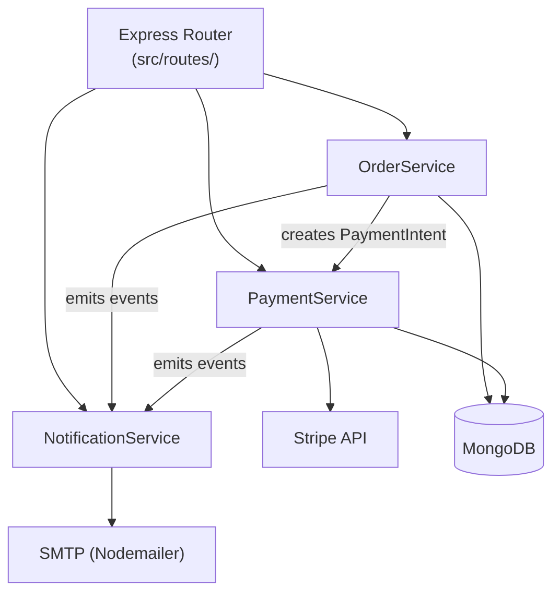

[Documentation Index](../index.md) / module3-services

# Services Overview

The service layer contains all business logic in Orderflow. Controllers in `src/routes/` are thin — they validate the request and delegate to a service. Services own all state transitions, external integrations, and event emission.

---

## Table of Contents

- [Architecture](#architecture)
- [Service Responsibilities](#service-responsibilities)
- [Inter-Service Communication](#inter-service-communication)
- [Error Handling Convention](#error-handling-convention)
- [Detailed Service Documentation](#detailed-service-documentation)

---

## Architecture



---

## Service Responsibilities

| Service | File | Owns |
|---|---|---|
| OrderService | `src/services/OrderService.ts` | Order creation, state machine transitions, fulfilment routing |
| PaymentService | `src/services/PaymentService.ts` | Stripe PaymentIntent lifecycle, payment status sync |
| NotificationService | `src/services/NotificationService.ts` | Email/SMS dispatch, retry logic, event subscription |

---

## Inter-Service Communication

Services communicate synchronously via direct method calls — there is no message queue. The call chain for a new order is:

```
OrderService.create()
  └── PaymentService.createIntent()        (if auto-charge enabled)
  └── NotificationService.emit('order.created')
```

> [!NOTE]
> `NotificationService.emit()` is fire-and-forget. It does not throw on failure — it logs the error and retries up to 3 times with exponential backoff. A notification failure never rolls back an order operation.

---

## Error Handling Convention

All services throw typed errors from `src/errors/`. Controllers catch these and map them to HTTP responses.

```typescript
// Example typed error
throw new AppError('ORDER_NOT_FOUND', 404, `Order ${id} not found`);
```

Services never return `null` for not-found cases — they always throw. This ensures controllers do not have to check for null returns.

---

## Detailed Service Documentation

- [Order Service](./orderService.md)
- [Payment Service](./paymentService.md)
- [Notification Service](./notificationService.md)
