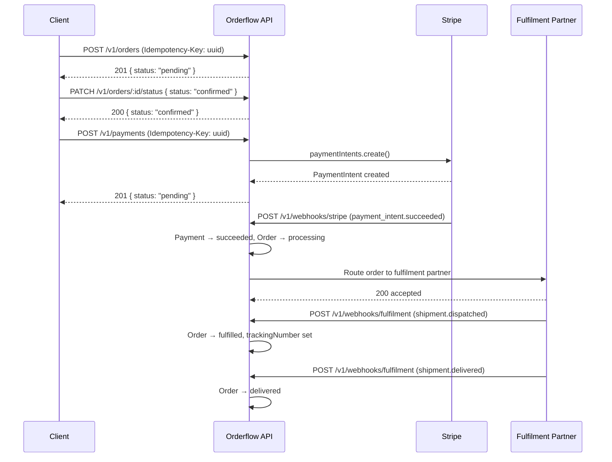

[Documentation Index](../index.md) / module5-workflows

# Workflows

This section documents end-to-end flows that combine multiple Orderflow services and API calls. Use these as the reference for integration, testing, and understanding the expected system behaviour for each scenario.

---

## Table of Contents

- [Workflow: Happy Path Order](#workflow-happy-path-order)
- [Workflow: Payment Failure and Retry](#workflow-payment-failure-and-retry)
- [Workflow: Order Cancellation](#workflow-order-cancellation)
- [Workflow: Fulfilment Partner Dispatch](#workflow-fulfilment-partner-dispatch)
- [Workflow: Refund](#workflow-refund)

---

## Workflow: Happy Path Order

The end-to-end flow for a successful order from creation to delivery.

---

## Workflow: Payment Failure and Retry

When Stripe declines a payment, the order remains `confirmed` and the customer can retry with a different payment method.

1. `POST /v1/payments` — Stripe declines synchronously → `402 PAYMENT_DECLINED`
2. Order status remains `confirmed`
3. Client prompts customer to update payment method
4. Client retries `POST /v1/payments` with a **new** `Idempotency-Key` and the new `paymentMethodId`

> [!NOTE]
> A new idempotency key is required on retry because the request body has changed (different `paymentMethodId`). Reusing the original key would return the original declined response.

---

## Workflow: Order Cancellation

Orders can be cancelled from `confirmed` or `processing` status.

1. `PATCH /v1/orders/:id/status { status: "cancelled", reason: "..." }` — must include `reason`
2. If the order was `processing` and payment succeeded: a refund must be issued separately via the refund workflow
3. Notification event `order.cancelled` is emitted — customer receives cancellation email

> [!WARNING]
> Cancelling a `processing` order does not automatically trigger a refund. The payment and the order status are separate concerns. Operators must manually initiate the refund workflow.

---

## Workflow: Fulfilment Partner Dispatch

When an order transitions to `processing` (triggered by payment success), Orderflow routes it to the fulfilment partner:

1. `OrderService.routeToFulfilmentPartner()` POSTs order details to the partner's inbound endpoint
2. If the partner API returns an error or times out: `fulfilmentStatus` is set to `routing_failed`, ops team is notified
3. Ops can manually re-trigger routing via the admin API (`POST /v1/admin/orders/:id/reroute`) — not exposed in the public API

---

## Workflow: Refund

Refunds are initiated via Stripe and propagated back via webhook.

1. Ops initiates a refund in the Stripe dashboard against the `stripePaymentIntentId`
2. Stripe emits `charge.refunded` webhook to `POST /v1/webhooks/stripe`
3. `PaymentService.syncFromStripeEvent()` updates `Payment.status` to `refunded` and sets `refundedAt`
4. `OrderService.transitionStatus()` is called with `refunded`
5. Notification event `order.refunded` is emitted — customer receives refund confirmation email

> [!NOTE]
> Partial refunds are not currently supported. Stripe partial refund events are received and logged but do not change `Payment.status` or `Order.status`.
